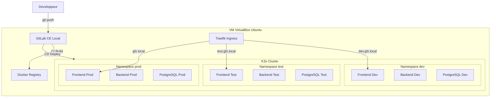

# Plan CI/CD avec K3s sur VM VirtualBox - Apprentissage Progressif

## Architecture Cible




## Phase 1 : Préparation de la VM (2-3 heures)

### Objectif

Comprendre et installer l'environnement de base : VM Ubuntu, outils essentiels.

### Étapes détaillées

1. **Créer la VM VirtualBox**
  - OS : Ubuntu Server 22.04 LTS
  - RAM : 6-8 GB minimum
  - CPU : 4 cores
  - Disque : 40 GB dynamique
  - Réseau : Bridge ou NAT avec port forwarding
2. **Configuration réseau**
  - IP statique sur la VM (ex: 192.168.1.100)
  - Port forwarding si NAT :
    - 8080 (host) → 80 (VM) : Traefik HTTP
    - 8443 (host) → 443 (VM) : Traefik HTTPS
    - 2222 (host) → 22 (VM) : SSH
    - 8888 (host) → 8080 (VM) : GitLab
3. **Installation des outils de base**
  ```bash
   sudo apt update && sudo apt upgrade -y
   sudo apt install -y curl wget git vim htop
  ```
4. **Configuration /etc/hosts sur Windows**
  Ajouter dans `C:\Windows\System32\drivers\etc\hosts` :

### Apprentissage

- Comprendre la différence entre réseau Bridge et NAT
- Savoir accéder à la VM via SSH depuis Windows (PuTTY ou PowerShell)

---

## Phase 2 : Installation K3s (1-2 heures)

### Objectif

Installer et comprendre K3s, explorer les commandes kubectl de base.

### Installation K3s

```bash
# Installation K3s (inclut kubectl, traefik par défaut)
curl -sfL https://get.k3s.io | sh -

# Configurer kubectl pour user normal
mkdir -p ~/.kube
sudo cp /etc/rancher/k3s/k3s.yaml ~/.kube/config
sudo chown $USER:$USER ~/.kube/config
export KUBECONFIG=~/.kube/config

# Vérifier l'installation
kubectl get nodes
kubectl get pods -A
```

### Créer les 3 namespaces

```bash
kubectl create namespace dev
kubectl create namespace test
kubectl create namespace prod

# Vérifier
kubectl get namespaces
```

### Commandes kubectl essentielles à apprendre

```bash
# Lister ressources
kubectl get pods -n dev
kubectl get deployments -n test
kubectl get services -n prod
kubectl get all -n dev

# Décrire une ressource
kubectl describe pod <nom-pod> -n dev

# Voir les logs
kubectl logs <nom-pod> -n dev -f

# Exécuter commande dans un pod
kubectl exec -it <nom-pod> -n dev -- /bin/sh

# Appliquer des manifests
kubectl apply -f fichier.yml -n dev

# Supprimer ressources
kubectl delete -f fichier.yml -n dev
```

### Apprentissage

- Comprendre l'architecture K3s (plus léger que K8s complet)
- Maîtriser les commandes kubectl de base
- Comprendre le concept de namespace (isolation logique)

### Fichiers à créer

Créer la structure suivante :

```
k8s/
├── README.md                    # Documentation kubectl
├── namespaces/
│   └── namespaces.yml          # Définition des 3 namespaces
├── dev/
│   ├── postgres-dev.yml
│   ├── backend-dev.yml
│   ├── frontend-dev.yml
│   └── ingress-dev.yml
├── test/
│   ├── postgres-test.yml
│   ├── backend-test.yml
│   ├── frontend-test.yml
│   └── ingress-test.yml
└── prod/
    ├── postgres-prod.yml
    ├── backend-prod.yml
    ├── frontend-prod.yml
    └── ingress-prod.yml
```

---

## Phase 3 : Déploiement Manuel sur K3s (3-4 heures)

### Objectif

Déployer manuellement l'application GFZ sur les 3 environnements pour comprendre les concepts K8s.

### Structure des manifests Kubernetes

Chaque environnement aura 4 composants :

1. **PostgreSQL** (StatefulSet + Service + PVC)
2. **Backend** (Deployment + Service + ConfigMap)
3. **Frontend** (Deployment + Service)
4. **Ingress** (Traefik IngressRoute)

### Exemple : PostgreSQL pour dev

Créer `[k8s/dev/postgres-dev.yml](k8s/dev/postgres-dev.yml)` :

```yaml
apiVersion: v1
kind: PersistentVolumeClaim
metadata:
  name: postgres-pvc
  namespace: dev
spec:
  accessModes:
    - ReadWriteOnce
  resources:
    requests:
      storage: 2Gi
---
apiVersion: v1
kind: ConfigMap
metadata:
  name: postgres-config
  namespace: dev
data:
  POSTGRES_DB: gfzdb_dev
  POSTGRES_USER: gfzuser
---
apiVersion: v1
kind: Secret
metadata:
  name: postgres-secret
  namespace: dev
type: Opaque
stringData:
  POSTGRES_PASSWORD: devpass123
---
apiVersion: apps/v1
kind: StatefulSet
metadata:
  name: postgres
  namespace: dev
spec:
  serviceName: postgres
  replicas: 1
  selector:
    matchLabels:
      app: postgres
  template:
    metadata:
      labels:
        app: postgres
    spec:
      containers:
      - name: postgres
        image: postgres:16-alpine
        ports:
        - containerPort: 5432
        envFrom:
        - configMapRef:
            name: postgres-config
        - secretRef:
            name: postgres-secret
        volumeMounts:
        - name: postgres-storage
          mountPath: /var/lib/postgresql/data
        resources:
          requests:
            memory: "256Mi"
            cpu: "200m"
          limits:
            memory: "512Mi"
            cpu: "500m"
  volumeClaimTemplates:
  - metadata:
      name: postgres-storage
    spec:
      accessModes: [ "ReadWriteOnce" ]
      resources:
        requests:
          storage: 2Gi
---
apiVersion: v1
kind: Service
metadata:
  name: postgres
  namespace: dev
spec:
  ports:
  - port: 5432
  clusterIP: None
  selector:
    app: postgres
```

### Exemple : Backend pour dev

Créer `[k8s/dev/backend-dev.yml](k8s/dev/backend-dev.yml)` :

```yaml
apiVersion: v1
kind: ConfigMap
metadata:
  name: backend-config
  namespace: dev
data:
  DB_HOST: postgres.dev.svc.cluster.local
  DB_PORT: "5432"
  DB_NAME: gfzdb_dev
  DB_USER: gfzuser
  CORS_ORIGINS: http://dev.gfz.local
  JWT_EXPIRATION: "3600000"
---
apiVersion: v1
kind: Secret
metadata:
  name: backend-secret
  namespace: dev
type: Opaque
stringData:
  DB_PASSWORD: devpass123
  JWT_SECRET: dev-jwt-secret-key-change-me
---
apiVersion: apps/v1
kind: Deployment
metadata:
  name: backend
  namespace: dev
spec:
  replicas: 1
  selector:
    matchLabels:
      app: backend
  template:
    metadata:
      labels:
        app: backend
    spec:
      containers:
      - name: backend
        image: gfz-backend:latest
        imagePullPolicy: Never  # Pour images locales
        ports:
        - containerPort: 8080
        envFrom:
        - configMapRef:
            name: backend-config
        - secretRef:
            name: backend-secret
        resources:
          requests:
            memory: "512Mi"
            cpu: "250m"
          limits:
            memory: "1Gi"
            cpu: "500m"
        livenessProbe:
          httpGet:
            path: /actuator/health
            port: 8080
          initialDelaySeconds: 60
          periodSeconds: 10
        readinessProbe:
          httpGet:
            path: /actuator/health
            port: 8080
          initialDelaySeconds: 30
          periodSeconds: 5
---
apiVersion: v1
kind: Service
metadata:
  name: backend
  namespace: dev
spec:
  selector:
    app: backend
  ports:
  - port: 8080
    targetPort: 8080
  type: ClusterIP
```

### Exemple : Frontend pour dev

Créer `[k8s/dev/frontend-dev.yml](k8s/dev/frontend-dev.yml)` :

```yaml
apiVersion: v1
kind: ConfigMap
metadata:
  name: frontend-config
  namespace: dev
data:
  API_BASE_URL: http://dev.gfz.local/api
  NODE_ENV: development
---
apiVersion: apps/v1
kind: Deployment
metadata:
  name: frontend
  namespace: dev
spec:
  replicas: 1
  selector:
    matchLabels:
      app: frontend
  template:
    metadata:
      labels:
        app: frontend
    spec:
      containers:
      - name: frontend
        image: gfz-frontend:latest
        imagePullPolicy: Never
        ports:
        - containerPort: 3000
        envFrom:
        - configMapRef:
            name: frontend-config
        resources:
          requests:
            memory: "256Mi"
            cpu: "200m"
          limits:
            memory: "512Mi"
            cpu: "400m"
---
apiVersion: v1
kind: Service
metadata:
  name: frontend
  namespace: dev
spec:
  selector:
    app: frontend
  ports:
  - port: 3000
    targetPort: 3000
  type: ClusterIP
```

### Exemple : Ingress pour dev

Créer `[k8s/dev/ingress-dev.yml](k8s/dev/ingress-dev.yml)` :

```yaml
apiVersion: traefik.containo.us/v1alpha1
kind: IngressRoute
metadata:
  name: gfz-dev
  namespace: dev
spec:
  entryPoints:
    - web
  routes:
  - match: Host(`dev.gfz.local`)
    kind: Rule
    services:
    - name: frontend
      port: 3000
  - match: Host(`dev.gfz.local`) && PathPrefix(`/api`)
    kind: Rule
    services:
    - name: backend
      port: 8080
```

### Déploiement manuel

```bash
# 1. Build les images Docker localement
cd ~/gfz-devops/frontend
docker build -t gfz-frontend:latest .

cd ~/gfz-devops/backend
docker build -t gfz-backend:latest .

# 2. Importer images dans K3s
sudo k3s ctr images import <(docker save gfz-frontend:latest)
sudo k3s ctr images import <(docker save gfz-backend:latest)

# 3. Déployer sur dev
kubectl apply -f k8s/namespaces/
kubectl apply -f k8s/dev/

# 4. Vérifier le déploiement
kubectl get all -n dev
kubectl logs -f deployment/backend -n dev

# 5. Tester l'accès
curl http://dev.gfz.local
```

### Répéter pour test et prod

Adapter les manifests pour `test` et `prod` avec :

- Namespaces différents
- Domaines différents (test.gfz.local, gfz.local)
- Secrets différents
- Réplicas augmentés pour prod (3 backend, 2 frontend)

### Apprentissage

- Comprendre Deployment vs StatefulSet
- Maîtriser ConfigMap et Secret
- Comprendre Service (ClusterIP, NodePort, LoadBalancer)
- Comprendre Ingress/IngressRoute Traefik
- Savoir débugger (logs, describe, exec)

---

## Phase 4 : Container Registry Local (1 heure)

### Objectif

Mettre en place un registry Docker local pour stocker les images.

### Installation

```bash
# Créer namespace pour infra
kubectl create namespace infra

# Déployer registry Docker
kubectl apply -f k8s/infra/registry.yml
```

Créer `[k8s/infra/registry.yml](k8s/infra/registry.yml)` :

```yaml
apiVersion: v1
kind: PersistentVolumeClaim
metadata:
  name: registry-pvc
  namespace: infra
spec:
  accessModes:
    - ReadWriteOnce
  resources:
    requests:
      storage: 10Gi
---
apiVersion: apps/v1
kind: Deployment
metadata:
  name: docker-registry
  namespace: infra
spec:
  replicas: 1
  selector:
    matchLabels:
      app: docker-registry
  template:
    metadata:
      labels:
        app: docker-registry
    spec:
      containers:
      - name: registry
        image: registry:2
        ports:
        - containerPort: 5000
        volumeMounts:
        - name: registry-storage
          mountPath: /var/lib/registry
      volumes:
      - name: registry-storage
        persistentVolumeClaim:
          claimName: registry-pvc
---
apiVersion: v1
kind: Service
metadata:
  name: docker-registry
  namespace: infra
spec:
  selector:
    app: docker-registry
  ports:
  - port: 5000
    targetPort: 5000
  type: NodePort
```

### Configuration

```bash
# Configurer K3s pour registry insecure
sudo vim /etc/rancher/k3s/registries.yaml
```

Ajouter :

```yaml
mirrors:
  "registry.gfz.local:5000":
    endpoint:
      - "http://docker-registry.infra.svc.cluster.local:5000"
```

```bash
# Redémarrer K3s
sudo systemctl restart k3s

# Tester
docker tag gfz-frontend:latest registry.gfz.local:5000/gfz-frontend:dev
docker push registry.gfz.local:5000/gfz-frontend:dev
```

---

## Phase 5 : GitLab CE Local (2-3 heures)

### Objectif

Installer GitLab Community Edition pour la CI/CD et héberger le code.

### Installation via Docker Compose

Créer `[gitlab/docker-compose.yml](gitlab/docker-compose.yml)` :

```yaml
version: '3.8'
services:
  gitlab:
    image: gitlab/gitlab-ce:latest
    container_name: gitlab
    hostname: gitlab.gfz.local
    environment:
      GITLAB_OMNIBUS_CONFIG: |
        external_url 'http://gitlab.gfz.local:8888'
        gitlab_rails['gitlab_shell_ssh_port'] = 2224
    ports:
      - "8888:8888"
      - "2224:22"
    volumes:
      - ./config:/etc/gitlab
      - ./logs:/var/log/gitlab
      - ./data:/var/opt/gitlab
    restart: always
```

```bash
# Démarrer GitLab
cd ~/gfz-devops/gitlab
docker-compose up -d

# Attendre 5-10 minutes, puis récupérer le mot de passe root
docker exec -it gitlab grep 'Password:' /etc/gitlab/initial_root_password

# Accéder : http://localhost:8888 (depuis Windows)
# User : root
# Password : celui affiché ci-dessus
```

### Configuration GitLab

1. Créer un nouveau projet "gfz-devops"
2. Push le code existant :

```bash
cd ~/gfz-devops
git init
git remote add origin http://gitlab.gfz.local:8888/root/gfz-devops.git
git add .
git commit -m "Initial commit"
git push -u origin main
```

1. Configurer GitLab Runner

```bash
# Installer GitLab Runner
sudo curl -L --output /usr/local/bin/gitlab-runner https://gitlab-runner-downloads.s3.amazonaws.com/latest/binaries/gitlab-runner-linux-amd64
sudo chmod +x /usr/local/bin/gitlab-runner
sudo useradd --comment 'GitLab Runner' --create-home gitlab-runner --shell /bin/bash
sudo gitlab-runner install --user=gitlab-runner --working-directory=/home/gitlab-runner
sudo gitlab-runner start

# Enregistrer le runner
sudo gitlab-runner register
# URL : http://gitlab.gfz.local:8888
# Token : depuis GitLab Settings > CI/CD > Runners
# Description : k3s-runner
# Tags : docker,k3s
# Executor : shell
```

---

## Phase 6 : Pipeline CI/CD GitLab (3-4 heures)

### Objectif

Créer un pipeline automatisé : Build → Test → Deploy sur dev/test/prod.

### Créer `.gitlab-ci.yml`

Créer `[.gitlab-ci.yml](.gitlab-ci.yml)` à la racine du projet :

```yaml
stages:
  - build
  - test
  - deploy-dev
  - deploy-test
  - deploy-prod

variables:
  REGISTRY: registry.gfz.local:5000
  FRONTEND_IMAGE: ${REGISTRY}/gfz-frontend
  BACKEND_IMAGE: ${REGISTRY}/gfz-backend

# BUILD STAGE
build-frontend:
  stage: build
  tags:
    - docker
  script:
    - cd frontend
    - docker build -t ${FRONTEND_IMAGE}:${CI_COMMIT_SHORT_SHA} .
    - docker tag ${FRONTEND_IMAGE}:${CI_COMMIT_SHORT_SHA} ${FRONTEND_IMAGE}:latest
    - docker push ${FRONTEND_IMAGE}:${CI_COMMIT_SHORT_SHA}
    - docker push ${FRONTEND_IMAGE}:latest
  only:
    - main
    - develop

build-backend:
  stage: build
  tags:
    - docker
  script:
    - cd backend
    - docker build -t ${BACKEND_IMAGE}:${CI_COMMIT_SHORT_SHA} .
    - docker tag ${BACKEND_IMAGE}:${CI_COMMIT_SHORT_SHA} ${BACKEND_IMAGE}:latest
    - docker push ${BACKEND_IMAGE}:${CI_COMMIT_SHORT_SHA}
    - docker push ${BACKEND_IMAGE}:latest
  only:
    - main
    - develop

# TEST STAGE
test-backend:
  stage: test
  tags:
    - docker
  script:
    - cd backend
    - mvn test
  only:
    - main
    - develop

# DEPLOY DEV (automatique sur develop)
deploy-dev:
  stage: deploy-dev
  tags:
    - k3s
  script:
    - kubectl set image deployment/frontend frontend=${FRONTEND_IMAGE}:${CI_COMMIT_SHORT_SHA} -n dev
    - kubectl set image deployment/backend backend=${BACKEND_IMAGE}:${CI_COMMIT_SHORT_SHA} -n dev
    - kubectl rollout status deployment/frontend -n dev
    - kubectl rollout status deployment/backend -n dev
  environment:
    name: development
    url: http://dev.gfz.local
  only:
    - develop

# DEPLOY TEST (automatique sur main)
deploy-test:
  stage: deploy-test
  tags:
    - k3s
  script:
    - kubectl set image deployment/frontend frontend=${FRONTEND_IMAGE}:${CI_COMMIT_SHORT_SHA} -n test
    - kubectl set image deployment/backend backend=${BACKEND_IMAGE}:${CI_COMMIT_SHORT_SHA} -n test
    - kubectl rollout status deployment/frontend -n test
    - kubectl rollout status deployment/backend -n test
  environment:
    name: testing
    url: http://test.gfz.local
  only:
    - main

# DEPLOY PROD (manuel uniquement)
deploy-prod:
  stage: deploy-prod
  tags:
    - k3s
  script:
    - kubectl set image deployment/frontend frontend=${FRONTEND_IMAGE}:${CI_COMMIT_SHORT_SHA} -n prod
    - kubectl set image deployment/backend backend=${BACKEND_IMAGE}:${CI_COMMIT_SHORT_SHA} -n prod
    - kubectl rollout status deployment/frontend -n prod
    - kubectl rollout status deployment/backend -n prod
  environment:
    name: production
    url: http://gfz.local
  when: manual
  only:
    - main
```

### Flux de travail

```
develop branch → push
  ↓
  Build images (frontend + backend)
  ↓
  Tests automatiques
  ↓
  Deploy automatique sur DEV

main branch → push
  ↓
  Build images
  ↓
  Tests automatiques
  ↓
  Deploy automatique sur TEST
  ↓
  Deploy MANUEL sur PROD (bouton dans GitLab)
```

### Apprentissage

- Comprendre les stages et jobs GitLab CI
- Maîtriser les variables CI/CD
- Comprendre la stratégie de branching (develop/main)
- Savoir déclencher des déploiements manuels

---

## Phase 7 : Ansible pour Automatisation (2-3 heures)

### Objectif

Utiliser Ansible pour automatiser la configuration de la VM et les déploiements.

### Installation Ansible

```bash
sudo apt install -y ansible
```

### Structure Ansible

Créer la structure suivante :

```
ansible/
├── inventory/
│   └── hosts.yml
├── group_vars/
│   └── all.yml
├── playbooks/
│   ├── 01-setup-vm.yml
│   ├── 02-install-k3s.yml
│   ├── 03-deploy-infra.yml
│   └── 04-deploy-app.yml
└── roles/
    ├── k3s/
    ├── docker/
    └── gitlab/
```

### Inventory

Créer `[ansible/inventory/hosts.yml](ansible/inventory/hosts.yml)` :

```yaml
all:
  hosts:
    k3s-vm:
      ansible_host: 192.168.1.100
      ansible_user: jerome
      ansible_become: yes
```

### Playbook : Setup VM

Créer `[ansible/playbooks/01-setup-vm.yml](ansible/playbooks/01-setup-vm.yml)` :

```yaml
---
- name: Configuration initiale de la VM
  hosts: k3s-vm
  become: yes
  
  tasks:
    - name: Mise à jour du système
      apt:
        update_cache: yes
        upgrade: dist
    
    - name: Installation outils de base
      apt:
        name:
          - curl
          - wget
          - git
          - vim
          - htop
          - docker.io
          - docker-compose
        state: present
    
    - name: Ajouter user au groupe docker
      user:
        name: "{{ ansible_user }}"
        groups: docker
        append: yes
    
    - name: Configuration sysctl pour K3s
      sysctl:
        name: "{{ item.key }}"
        value: "{{ item.value }}"
        state: present
        reload: yes
      loop:
        - { key: 'net.ipv4.ip_forward', value: '1' }
        - { key: 'net.bridge.bridge-nf-call-iptables', value: '1' }
```

### Playbook : Déploiement K3s

Créer `[ansible/playbooks/02-install-k3s.yml](ansible/playbooks/02-install-k3s.yml)` :

```yaml
---
- name: Installation et configuration K3s
  hosts: k3s-vm
  become: yes
  
  tasks:
    - name: Télécharger script K3s
      get_url:
        url: https://get.k3s.io
        dest: /tmp/k3s-install.sh
        mode: '0755'
    
    - name: Installer K3s
      shell: /tmp/k3s-install.sh
      args:
        creates: /usr/local/bin/k3s
    
    - name: Créer répertoire .kube
      file:
        path: "/home/{{ ansible_user }}/.kube"
        state: directory
        owner: "{{ ansible_user }}"
        group: "{{ ansible_user }}"
    
    - name: Copier kubeconfig
      copy:
        src: /etc/rancher/k3s/k3s.yaml
        dest: "/home/{{ ansible_user }}/.kube/config"
        owner: "{{ ansible_user }}"
        group: "{{ ansible_user }}"
        mode: '0600'
        remote_src: yes
    
    - name: Créer les namespaces
      kubernetes.core.k8s:
        name: "{{ item }}"
        api_version: v1
        kind: Namespace
        state: present
      loop:
        - dev
        - test
        - prod
        - infra
```

### Playbook : Déploiement Application

Créer `[ansible/playbooks/04-deploy-app.yml](ansible/playbooks/04-deploy-app.yml)` :

```yaml
---
- name: Déploiement de l'application GFZ
  hosts: k3s-vm
  
  vars:
    namespace: "{{ target_env | default('dev') }}"
    image_tag: "{{ tag | default('latest') }}"
  
  tasks:
    - name: Appliquer manifests PostgreSQL
      kubernetes.core.k8s:
        state: present
        src: "../../k8s/{{ namespace }}/postgres-{{ namespace }}.yml"
        namespace: "{{ namespace }}"
    
    - name: Appliquer manifests Backend
      kubernetes.core.k8s:
        state: present
        src: "../../k8s/{{ namespace }}/backend-{{ namespace }}.yml"
        namespace: "{{ namespace }}"
    
    - name: Appliquer manifests Frontend
      kubernetes.core.k8s:
        state: present
        src: "../../k8s/{{ namespace }}/frontend-{{ namespace }}.yml"
        namespace: "{{ namespace }}"
    
    - name: Appliquer manifests Ingress
      kubernetes.core.k8s:
        state: present
        src: "../../k8s/{{ namespace }}/ingress-{{ namespace }}.yml"
        namespace: "{{ namespace }}"
    
    - name: Attendre que les pods soient prêts
      kubernetes.core.k8s_info:
        kind: Pod
        namespace: "{{ namespace }}"
        label_selectors:
          - "app in (frontend,backend,postgres)"
      register: pod_list
      until: pod_list.resources | selectattr('status.phase', 'equalto', 'Running') | list | length == 3
      retries: 30
      delay: 10
```

### Utilisation Ansible

```bash
# Setup complet de la VM
ansible-playbook -i ansible/inventory/hosts.yml ansible/playbooks/01-setup-vm.yml

# Installer K3s
ansible-playbook -i ansible/inventory/hosts.yml ansible/playbooks/02-install-k3s.yml

# Déployer sur dev
ansible-playbook -i ansible/inventory/hosts.yml ansible/playbooks/04-deploy-app.yml -e "target_env=dev"

# Déployer sur prod avec tag spécifique
ansible-playbook -i ansible/inventory/hosts.yml ansible/playbooks/04-deploy-app.yml -e "target_env=prod tag=v1.2.3"
```

---

## Phase 8 : Monitoring et Observabilité (2-3 heures)

### Objectif

Installer Prometheus et Grafana pour monitorer le cluster et les applications.

### Installation via Helm

```bash
# Installer Helm
curl https://raw.githubusercontent.com/helm/helm/main/scripts/get-helm-3 | bash

# Ajouter repo Prometheus
helm repo add prometheus-community https://prometheus-community.github.io/helm-charts
helm repo update

# Installer kube-prometheus-stack
kubectl create namespace monitoring
helm install prometheus prometheus-community/kube-prometheus-stack -n monitoring

# Exposer Grafana
kubectl port-forward -n monitoring svc/prometheus-grafana 3001:80

# Accès : http://localhost:3001
# User : admin
# Password : kubectl get secret -n monitoring prometheus-grafana -o jsonpath="{.data.admin-password}" | base64 --decode
```

### Dashboards recommandés

1. **Cluster Overview** (ID: 7249)
2. **Node Exporter Full** (ID: 1860)
3. **PostgreSQL** (ID: 9628)
4. **Spring Boot 2.1** (ID: 10280)

### Apprentissage

- Comprendre Prometheus (scraping, métriques)
- Maîtriser Grafana (dashboards, alertes)
- Savoir créer des alertes personnalisées

---

## Phase 9 : Backups et Disaster Recovery (2 heures)

### Objectif

Mettre en place des backups automatiques des bases de données et des configurations.

### Script de backup PostgreSQL

Créer `[scripts/backup-postgres.sh](scripts/backup-postgres.sh)` :

```bash
#!/bin/bash
NAMESPACE=$1
DATE=$(date +%Y%m%d_%H%M%S)
BACKUP_DIR="/backups/${NAMESPACE}"

mkdir -p ${BACKUP_DIR}

# Backup de la base de données
kubectl exec -n ${NAMESPACE} postgres-0 -- pg_dump -U gfzuser gfzdb_${NAMESPACE} > ${BACKUP_DIR}/db_${DATE}.sql

# Garder seulement les 7 derniers backups
find ${BACKUP_DIR} -name "db_*.sql" -mtime +7 -delete

echo "Backup terminé : ${BACKUP_DIR}/db_${DATE}.sql"
```

### Cron job pour backups automatiques

```bash
# Ajouter dans crontab
crontab -e

# Backup quotidien à 3h du matin
0 3 * * * /home/jerome/gfz-devops/scripts/backup-postgres.sh prod
0 3 * * * /home/jerome/gfz-devops/scripts/backup-postgres.sh test
```

### Backup des manifests K8s

```bash
# Exporter toutes les ressources
kubectl get all --all-namespaces -o yaml > k8s-backup-$(date +%Y%m%d).yml
```

---

## Phase 10 : Documentation et Optimisations (1-2 heures)

### Documentation à créer

1. **README principal** avec architecture complète
2. **Guide de déploiement** pour chaque environnement
3. **Runbook** pour incidents courants
4. **Procédures de rollback**

### Optimisations

1. **Resource limits** : Ajuster selon utilisation réelle
2. **HPA (Horizontal Pod Autoscaler)** : Auto-scaling des pods
3. **Network Policies** : Isoler les namespaces
4. **Pod Disruption Budgets** : Garantir disponibilité
5. **Liveness/Readiness probes** : Améliorer la résilience

---

## Résumé de l'infrastructure finale

### Composants installés

- K3s (Kubernetes léger)
- Traefik (Ingress Controller)
- Docker Registry local
- GitLab CE + GitLab Runner
- Prometheus + Grafana
- PostgreSQL par environnement

### Environnements

- **dev** : develop branch → deploy auto
- **test** : main branch → deploy auto
- **prod** : main branch → deploy manuel

### URLs d'accès

- Dev : [http://dev.gfz.local:8080](http://dev.gfz.local:8080)
- Test : [http://test.gfz.local:8080](http://test.gfz.local:8080)
- Prod : [http://gfz.local:8080](http://gfz.local:8080)
- GitLab : [http://localhost:8888](http://localhost:8888)
- Grafana : [http://localhost:3001](http://localhost:3001)

### Ressources VM utilisées

- RAM : 6-7 GB (pics à 8 GB)
- CPU : 60-80% en moyenne
- Disque : 25-30 GB

---

## Commandes de dépannage essentielles

```bash
# Vérifier état du cluster
kubectl get nodes
kubectl top nodes
kubectl top pods -A

# Logs
kubectl logs -f <pod> -n <namespace>
kubectl logs -f deployment/<name> -n <namespace>

# Redémarrer un déploiement
kubectl rollout restart deployment/<name> -n <namespace>

# Rollback
kubectl rollout undo deployment/<name> -n <namespace>

# Debug
kubectl describe pod <pod> -n <namespace>
kubectl exec -it <pod> -n <namespace> -- /bin/sh

# Nettoyer ressources
kubectl delete pod <pod> -n <namespace> --grace-period=0 --force
```

---

## Prochaines étapes d'apprentissage

1. **Terraform** : Automatiser la création de VMs (pour multi-VMs)
2. **ArgoCD** : GitOps avancé
3. **Istio** : Service mesh pour microservices
4. **Velero** : Backups cluster complets
5. **Cert-Manager** : SSL automatique Let's Encrypt

